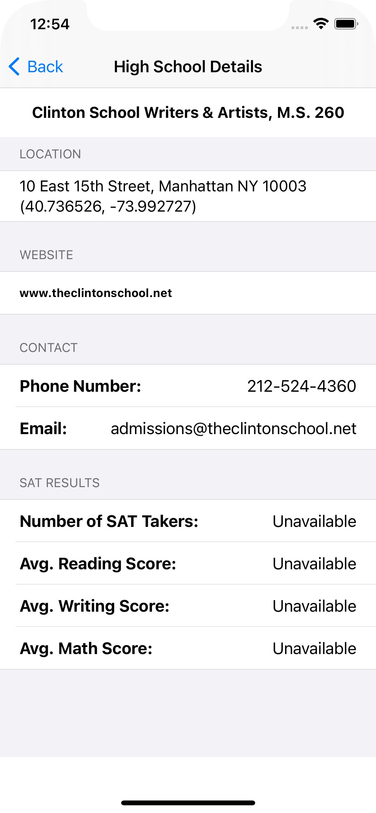

# NYC Schools

App lists the high schools and displays information related to the SAT Scores for High Schools.

  
  
  

NOTE: I did not do anything with safe area insets in the code specifically. I used the built in styling to handle it. I can make a change to directly show me using it.